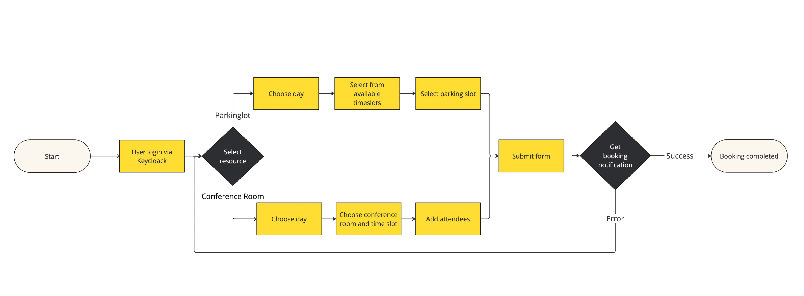
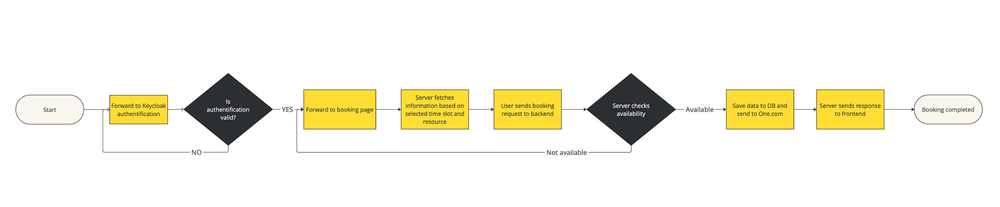

= DACH Project Consulting Reservierungstool
:icons: font

[%autowidth, cols="a,a", frame=none, grid=none]
|===
| image::https://img.shields.io/badge/lang-de-green.svg[link=README.de.adoc]
| image::https://img.shields.io/badge/lang-en-green.svg[link=README.adoc]
|===

NOTE: Dieses Projekt befindet sich noch in den frühen Entwicklungsphasen. Die README wird im Verlauf des Projekts aktualisiert.

== Überblick
Das DACH PC-Reservierungstool ist ein webbasiertes Reservierungssystem, das die Buchung von Ressourcen wie Parkplätzen und Konferenzräumen erleichtern soll. Dieses Tool zielt darauf ab, die Ressourcennutzung, Terminplanung und Benutzererfahrung für authentifizierte Benutzer innerhalb einer Organisation zu verbessern. In zukünftigen Versionen könnte die Möglichkeit hinzugefügt werden, zusätzliche Ressourcen zu buchen.

Darüber hinaus wird das Projekt öffentlich gemacht, um potenziellen Bewerberinnen und Bewerbern die Möglichkeit zu geben, ihre Fähigkeiten und analytischen Kompetenzen unter Beweis zu stellen, indem sie Pull-Requests einreichen. Auf diese Weise können Kandidaten mit dem Code arbeiten, Verbesserungen vorschlagen und aktiv zum Projekt beitragen.

== Funktionen

=== 1. Ressourcenreservierung

Das Tool unterstützt derzeit Reservierungen für:

1. Parkplätze
2. Konferenzräume
3. Potenzial zur Unterstützung weiterer Ressourcentypen in zukünftigen Versionen

=== 2. Benutzer-Authentifizierung

Die Anwendung verwendet Keycloak für eine sichere Benutzer-Authentifizierung und ermöglicht nur autorisierten Personen den Zugriff auf das System und die Durchführung von Reservierungen.

=== 3. Kalenderintegration

- Nach der Buchung wird der Ersteller der Reservierung als Teilnehmer hinzugefügt.
- Diese Integration ermöglicht es den Benutzern, ihre Reservierungen direkt in ihrem persönlichen Kalender einzusehen, damit sie über bevorstehende Reservierungen informiert bleiben.

== Technischer Stack

=== Frontend
- https://react.dev/[React]
- https://vite.dev/[Vite]
- https://www.npmjs.com/[Node Package Manager (NPM)]
- https://mantine.dev/[Mantine.ui]

=== Backend
- https://spring.io/[Spring Boot]
- https://www.postgresql.org/[PostgreSQL]
- https://www.one.com/de/[One.com]-API für die Kalenderintegration
- https://www.keycloak.org/[Keycloak] für die Benutzer-Authentifizierung
- https://www.docker.com/[Docker] für die Containerisierung

== Die App zum Laufen bringen
Zunächst sollte sichergestellt werden, dass Docker und Java (mindestens Version 21) installiert sind.

* Zieh das Projekt von Github mit 'git clone xxx' (google bei Bedarf wie das geht).
* Öffne dein Terminal und gehe zum 'reservation-tool' Ordner und dann zum backend mit 'cd backend'.
* Öffne die Docker App und gehe dann zurück ins terminal und starte den Docker container mit 'docker-compose up -d' (das startet die Datenbank). Gehe wieder zurück zum 'reserveation-tool' Ordner mit 'cd ..'.
* Starte das backend indem du den backend Ordner in deiner bevorzugten Entwicklungsumgebung öffnest und die main Klasse startest ('/src/main.java.com.dach.reservation_tool/ReservationToolApplication').
* Gehe im Terminal zum frontend Ordner ('cd frontend') und starte das frontend mit dem Befehl 'npm i'.

Jetzt sollte alles laufen. Du kannst das Frontend sehen indem du 'localhost:5174' in dein Browser tippst.

== Abläufe

=== User Flow

=== Technical Flow
